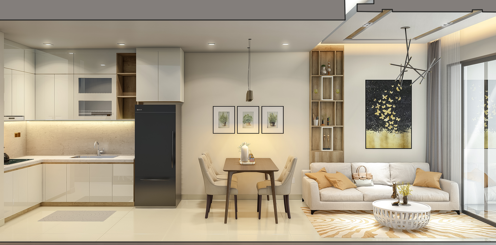
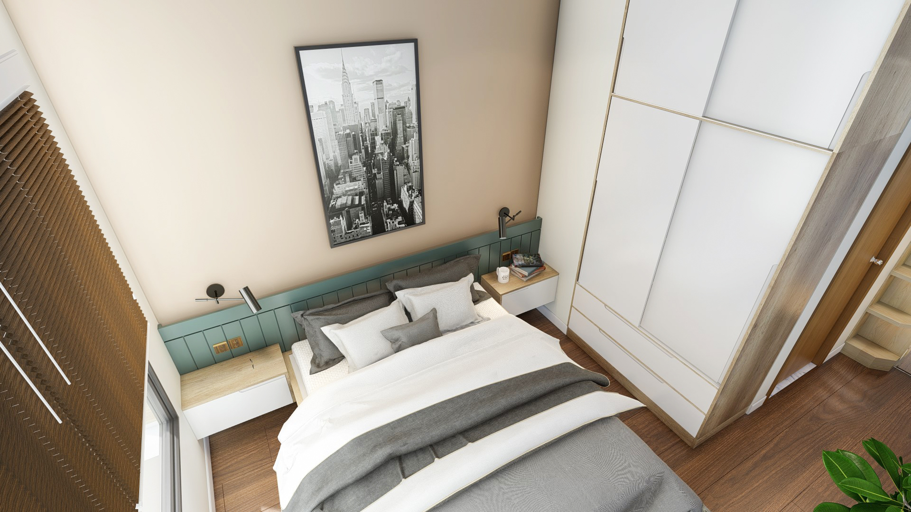
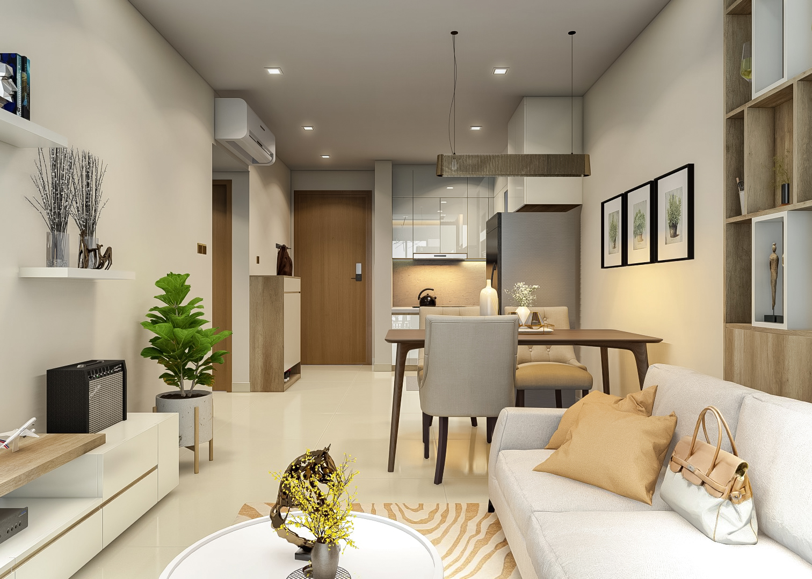
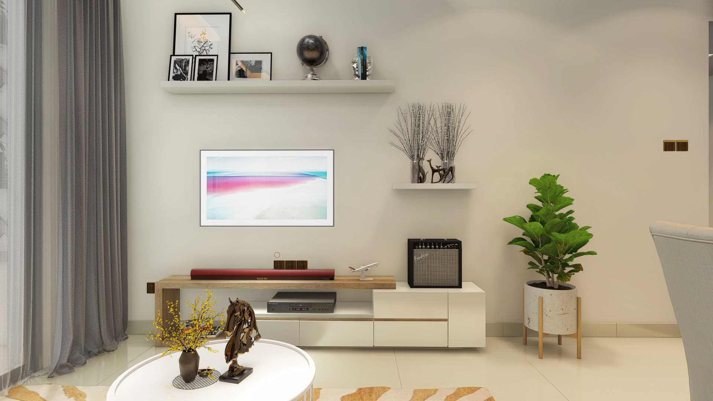

Trong bối cảnh không gian nội thất ngày càng thay đổi, khái niệm về cuộc sống hiện đại đã chiếm ưu thế. Hôm nay, chúng ta sẽ khám phá những chi tiết tinh tế của việc tạo ra một ốc đảo hiện đại - một căn hộ 3 phòng ngủ sang trọng với 2 phòng tắm, được sắp đặt một cách khéo léo trong 120 mét vuông khiêm tốn.

## Tối Ưu Hóa Không Gian với Phong Cách Sống Mở

Chìa khóa để thu hút của căn hộ hiện đại này nằm ở cam kết với phong cách sống mở. Bằng cách loại bỏ các bức tường chia phòng không cần thiết, thiết kế mở cửa nơi này tạo ra một môi trường linh hoạt và kết nối. Phòng khách dễ dàng chuyển đổi thành khu vực ăn và nhà bếp, khuyến khích không khí thân thiện và tối đa hóa không gian 120 mét vuông.

## Phòng Ngủ Phong Cách và Thực Tế

Ba phòng ngủ là minh chứng cho sự kết hợp giữa phong cách và tính thực tế. Mỗi phòng được thiết kế một cách cân nhắc để cân bằng giữa thẩm mỹ và tính ứng dụng, mang đến cho cư dân một nơi yên bình. Sử dụng bảng màu trung tính tăng cường cảm giác không gian, trong khi cửa sổ lớn làm cho phòng trở nên rộng lớn và tràn ngập ánh sáng tự nhiên, tạo ra không khí thoải mái và yên bình. Giải pháp lưu trữ đầy đủ, bao gồm tủ âm và lưu trữ dưới giường, đảm bảo rằng phòng ngủ luôn gọn gàng, đóng góp vào cảm giác đơn giản hiện đại.

## Phòng Tắm Sang Trọng Cho Sự Thư Giãn

Hai phòng tắm trong căn hộ hiện đại này được thiết kế như những ốc đảo cá nhân, thể hiện không khí như spa. Các đường nét sạch sẽ, thiết bị tối giản và sự phối màu hài hòa góp phần tạo nên cảm giác bình yên. Kết hợp giữa khu vực tắm vòi sen rộng rãi và bồn tắm thanh lịch mang lại sự linh hoạt cho cư dân, giúp họ thư giãn một cách sang trọng. Vật liệu cao cấp như gạch lát bóng mịn và bàn trang điểm hiện đại làm nổi bật phòng tắm, biến chúng thành những ốc đảo sang trọng trong không gian hạn chế.

## Sử Dụng Thông Minh Không Gian

Mỗi Xen-ti-met của 120 mét vuông được xem xét cẩn thận để tối ưu hóa tính tiện ích. Nội thất đa chức năng, như bàn gập và ghế modul, thêm tính linh hoạt vào không gian sống. Giải pháp lưu trữ thông minh, như kệ sách tích hợp và tủ ẩn, tiếp tục đóng góp vào phong cách gọn gàng và không có rối trong căn hộ. Thiết kế hướng đến nguyên tắc tối giản, đảm bảo mỗi yếu tố phục vụ một mục đích trong khi duy trì sự cân bằng thẩm mỹ.

## Kết Hợp Công Nghệ
Để thực sự đồng hành với tinh thần hiện đại, công nghệ được tích hợp một cách mượt mà khắp căn hộ. Các tính năng nhà thông minh, như đèn tự động, điều khiển khí hậu và hệ thống an ninh tự động, không chỉ nâng cao cuộc sống hàng ngày mà còn đóng góp vào sự hấp dẫn hiện đại tổng thể của không gian. Căn hộ trở thành một nơi nương tựa nơi thiết kế hiện đại gặp gỡ sự tiện lợi của công nghệ đương đại.

Tóm lại, căn hộ hiện đại 3 phòng ngủ, 2 phòng tắm này thể hiện nghệ thuật thiết kế có tâm trong không gian hạn chế. Bằng cách om sát phong cách sống mở, thẩm mỹ tinh tế và sự tận dụng thông minh của không gian, căn hộ trở thành một minh chứng cho khả năng sống đương đại, chứng minh rằng ngay cả trong 120 mét vuông, bạn có thể tạo ra một ngôi nhà vừa sang trọng vừa tiện ích.